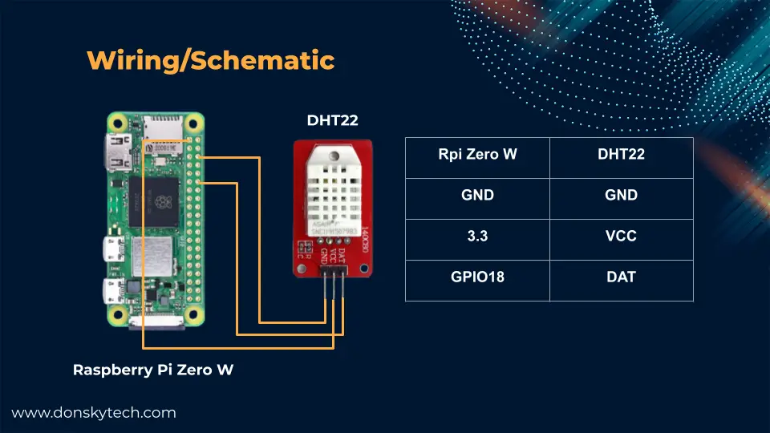
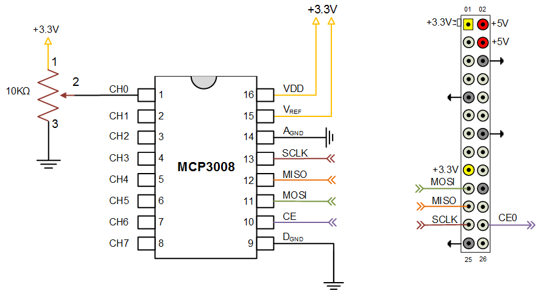
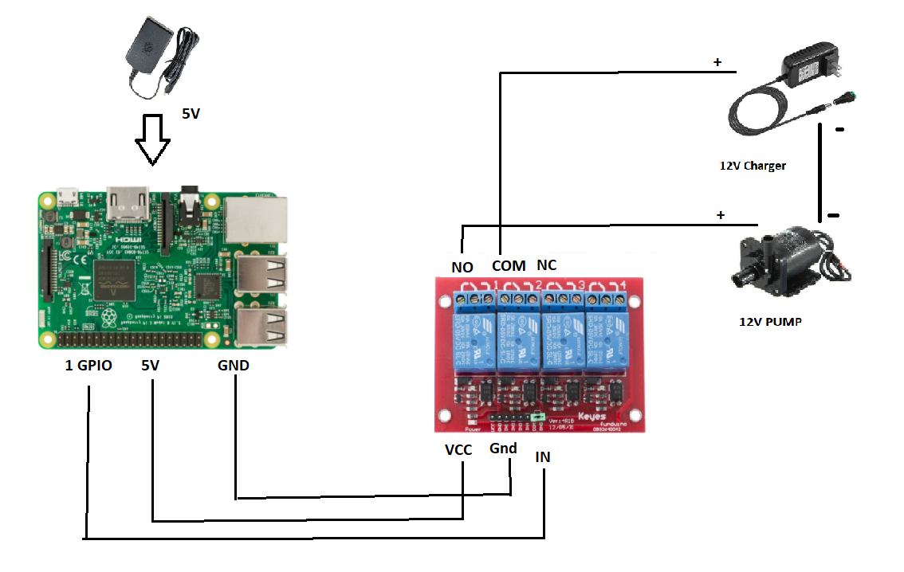

# Physical Setup

This documents serves to provide step by step instructions to exactly reproduce the physical setup of the Greenhouse. The Greenhouse used in this project can be bought [here](https://www.biltema.no/en-no/leisure/garden/planting/greenhouse-cultivation/greenhouse-wood-69-x-49-cm-2000045538), but any Greenhouse can be used in the same way.

The main components of the setup are:

- a _Controller_
- an _Actuator_
- a Router
- a Host (provided as a vm)

The _Controller_ and _Actuator_ can be run on the same raspberry with minimal changes.

## OS Choice

The choice made for the project was `Raspberry Pi OS 64bit`. Any compatible operating system will work in practice, use the 32bit version if the raspberry is not compatible with 64bit operating systems (older than the Pi 4 and the Pi 4 with 4GB of RAM). It is also recommended to have a desktop environment at least on the host computer for a simpler data analysis.

Finally, it is recommend to use the [Raspberry Pi Imager](https://www.raspberrypi.com/software) which can also be installed with apt: `sudo apt install rpi-imager`

## Controller setup

Update the system at first with
    - `sudo apt-get update`
    - `sudo apt full-upgrade`

### Connect DHT22 sensor

1. Refer to the following schematics:

2. Install dependencies:
    - `sudo apt-get install python3-pip git`
    - `sudo pip3 install --upgrade setuptools`
3. Install adafruit-circuitpython-dht library (we avoid using the deprecated Adafruit_DHT one):
    - `git clone https://github.com/donskytech/raspberrypi-projects`
    - `cd raspberrypi-projects/dht22`
4. Install circuitpython dependecies:
    - `sudo pip3 install --upgrade adafruit-python-shell`
    - `wget https://raw.githubusercontent.com/adafruit/Raspberry-Pi-Installer-Scripts/master/raspi-blinka.py`
    - `sudo python3 raspi-blinka.py`
    - select yes when prompted for reboot
5. Install the library:
    - `pip3 install adafruit-circuitpython-dht`

#### Example script to read the sensor

Credits to <https://www.donskytech.com/raspberry-pi-how-to-interface-with-a-dht22-sensor/>

```python

# SPDX-FileCopyrightText: 2021 ladyada for Adafruit Industries
# SPDX-License-Identifier: MIT

import time
import board
import adafruit_dht

# Initialize the dht device, with whichever data pin it's connected to:
dhtDevice = adafruit_dht.DHT22(board.D18)

# you can pass DHT22 use_pulseio=False if you wouldn't like to use pulseio.
# This may be necessary on a Linux single board computer like the Raspberry Pi,
# but it will not work in CircuitPython.
# dhtDevice = adafruit_dht.DHT22(board.D24, use_pulseio=False)

while True:
    try:
        # Print the values to the serial port
        temperature_c = dhtDevice.temperature
        humidity = dhtDevice.humidity
        print(
            "Temp: {:.1f} C    Humidity: {}% ".format(
                temperature_c, humidity
            )
        )

    except RuntimeError as error:
        # Errors happen fairly often, DHT's are hard to read, just keep going
        print(error.args[0])
        time.sleep(2.0)
        continue
    except Exception as error:
        dhtDevice.exit()
        raise error

    time.sleep(2.0)
```

### Use a webcam as approximation of a light sensor

1. Plug in a USB webcam
2. Install dependencies:
    - `pip install opencv-python` (one could use picamera2 instead but it has limited support for USB cameras, picamera is not supported on 64bit architectures)
    - `sudo apt install libg11`

#### Example script to print light level

```python

import cv2

from time import sleep

cap = cv2.VideoCapture(0)

sleep(2) #lets webcam adjust its exposure

# Turn off automatic exposure compensation, this means that
# the measurements are only significant when compared to the
# first one, to get proper lux reading one should use a
# proper light sensor
cap.set(cv2.CAP_PROP_AUTO_EXPOSURE, 0)

while True:
    ret, frame = cap.read()
    grey = cv2.cvtColor(frame, cv2.COLOR_BGR2GRAY)
    avg_light_level = cv2.mean(grey)[0]
    print(avg_light_level)

    if cv2.waitKey(1) & 0xFF == ord('q'):
        break

    sleep(1)

cap.release()
cv2.destroyAllWindows()

```

### Connect sensors (moisture) to MCP3008 ADC

1. Refer to the following schematics: 
2. Install dependencies:
    - `sudo apt-get install python3-spidev`

The adc can accept 8 inputs in the 8 different channels, channel numbering starts from 0, the pin connected to the channel should be the data pin of the sensor, the other pins should be connected to a 3.3V/5v pin and to the ground pin.

#### Classes needed to read the ADC and example script

``` python
#file: MCP3008.py

from spidev import SpiDev

class MCP3008:
    def __init__(self, bus = 0, device = 0):
        self.bus, self.device = bus, device
        self.spi = SpiDev()
        self.open()
        self.spi.max_speed_hz = 1000000 # 1MHz

    def open(self):
        self.spi.open(self.bus, self.device)
        self.spi.max_speed_hz = 1000000 # 1MHz
    
    def read(self, channel = 0):
        adc = self.spi.xfer2([1, (8 + channel) << 4, 0])
        data = ((adc[1] & 3) << 8) + adc[2]
        return data
            
    def close(self):
        self.spi.close()
```

``` python
from MCP3008 import MCP3008

adc = MCP3008()
value = adc.read(channel = 0) # You can of course adapt the channel to be read out
print("Applied voltage: %.2f" % (value / 1023.0 * 3.3))
```

### Connect raspberry pi NoIR camera

1. Connect the camera to the raspberry pi
2. It is possible that we need to modify the `/boot/config.txt` file to enable the camera:
    - `sudo nano /boot/config.txt`
    - uncomment the line `start_x=1`
    - uncomment the line `gpu_mem=128`
    - save and exit
    - reboot
3. Install dependencies:
    - `sudo apt-get update`
    - `sudo apt-get install -y python3-pyqt5 python3-opengl`
    - `sudo apt-get install -y python3-picamera2 --no-install-recommends`
    - `sudo pip3 install -U numpy`
    - `sudo pip3 install opencv-python`
    - `sudo apt install -y libatlas-base-dev`

### Set up an automation script for the installation of the data collector

It is possible to create a script that will automatically install the data collector and all its dependencies. This is useful if you want to replicate the project on multiple devices. Once cloned the repository the following script need to be executed:

```bash
#!/bin/bash

sudo apt update
sudo apt install -y \
    python3-pip \
    python3-spidev \
    python3-pyqt5 \
    python3-opengl \
    python3-picamera2 --no-install-recommends \
    opencv-python \
    libg11 \
    libatlas-base-dev

pip3 install opencv-python numpy

# Modifies boot config to enable the camera
sudo sed -i 's/# start_x=1/start_x=1/g' /boot/config.txt
sudo sed -i 's/# gpu_mem=128/gpu_mem=128/g' /boot/config.txt

sudo pip3 install --upgrade setuptools

# Install adafruit-circuitpython-dht library (we avoid using the deprecated Adafruit_DHT one)
git clone https://github.com/donskytech/raspberrypi-projects
cd raspberrypi-projects/dht22

# Install circuitpython dependecies
sudo pip3 install --upgrade adafruit-python-shell

wget https://raw.githubusercontent.com/adafruit/Raspberry-Pi-Installer-Scripts/master/raspi-blinka.py

echo "When prompted for reboot select yes, afterwards you should install the library \
    with 'pip3 install adafruit-circuitpython-dht'"
sudo python3 raspi-blinka.py

exit 1
```

### Set up the data collector from the image

For the data collector, a `.img` file can be retrieved here. It can be saved on a 32 GB microSD card with the `dd` utilities. The image is based on the Raspberry Pi OS 64bit version. The image is configured to use the following credentials:

- username: `lab`
- password: `lab`

### Change the hostname for the collector

To make the correct connection to the Message Broker via Python, the hostname of the raspberry pi needs to be changed according the id of the collector. This can be done by editing the `/etc/hostname` file and changing the hostname to `collector<id>`, where `<id>` is the id of the collector. The same name need to be used in the `/etc/hosts` file to map the hostname to the ip address of the raspberry pi.

To code for the collector can be cloned from the [repository](https://github.com/sievericcardo/greenhouse-data-collector).

## Actuator setup

### Connect a relay for a pump

1. Refer to the following schematics: 
2. Use the library from git as referenced in the other module

#### Example script

```python
import RPi.GPIO as GPIO
from time import sleep


def pump_water(sec, pump_pin):
    print("Pumping water for {} seconds...".format(sec))

    # set GPIO mode and set up the pump pin
    GPIO.setmode(GPIO.BCM)
    GPIO.setup(pump_pin, GPIO.OUT)

    try:
        # turn the pump off for 0.25 seconds
        GPIO.output(pump_pin, GPIO.LOW)
        sleep(0.25)

        # turn the pump on for the given time
        GPIO.output(pump_pin, GPIO.HIGH)
        sleep(sec)

        # turn the pump off
        GPIO.cleanup()

        print("Done pumping water.")

    except KeyboardInterrupt:
        # stop pump when ctrl-c is pressed
        GPIO.cleanup()
```

### Set up the actuator from the image

For the actuator, a `.img` file can be retrieved here. It can be saved on a 32 GB microSD card with the `dd` utilities. The image is based on the Raspberry Pi OS 64bit version. The image is configured to use the following credentials:

- username: `lab`
- password: `lab`

### Change the hostname for the actuator

To make the correct connection to the Message Broker via Python, the hostname of the raspberry pi needs to be changed according the id of the actuator. This can be done by editing the `/etc/hostname` file and changing the hostname to `actuator<id>`, where `<id>` is the id of the pump for the specific plant (It is possible to have a single actuator with a single pump id if different pins are used). The same name need to be used in the `/etc/hosts` file to map the hostname to the ip address of the raspberry pi.

### Clone the actuator code

To code for the actuator can be cloned from the [repository](https://github.com/sievericcardo/greenhouse_actuator).
